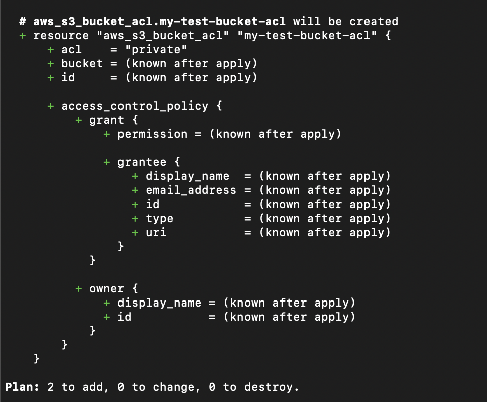

# Create first S3 with Terraform

Commands:
- terraform planshow -- what will be executed
  
- terraform apply: create a new bucket in S3
- add new bucket and acl for the bucket
    
- terraform plan -out="tfplan.out" -- create execution plan in file to apply
- terraform apply "tfplan.out" -- execute the plan created before
- terraform destroy -- delete all objectws created in script, in this case drop the bucket
