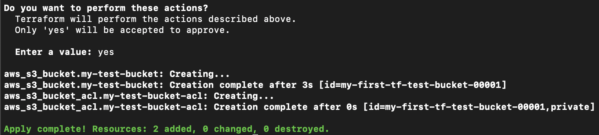

# Basics commands with Terraform

Commands For S3:
- terraform plan -- show what will be created/changed/deleted
  
- terraform apply: create a new bucket in S3
- add new bucket and acl for the bucket
    
- terraform plan -out="tfplan.out" -- create execution plan in file to apply
- terraform apply "tfplan.out" -- execute the plan created before
- terraform destroy -- delete all objectws created in script, in this case drop the bucket

Commands For EC2 Instance:
- terraform plan -var-file="prod.tfvars" -- show a plan for prod env
- terraform apply -var-file="prod.tfvars" -auto-approve -- create instances using prod env with auto aprove
- terraform destroy -var-file="prod.tfvars" -auto-approve -- delete instances using prod env with auto aprove
- Important: Precedence definition used by terraform -> https://www.terraform.io/language/values/variables#variable-definition-precedence

Commands For Interpolation
- terraform plan -- will output some values like
   
- terraform apply -auto-approve -- will create S3 Bucket with an Object (ips.json).
- Doc about Interpolation Syntax https://www.terraform.io/language/configuration-0-11/interpolation
- Doc about Local Variables https://www.terraform.io/language/values/locals
- Doc about Output Values https://www.terraform.io/language/values/outputs
